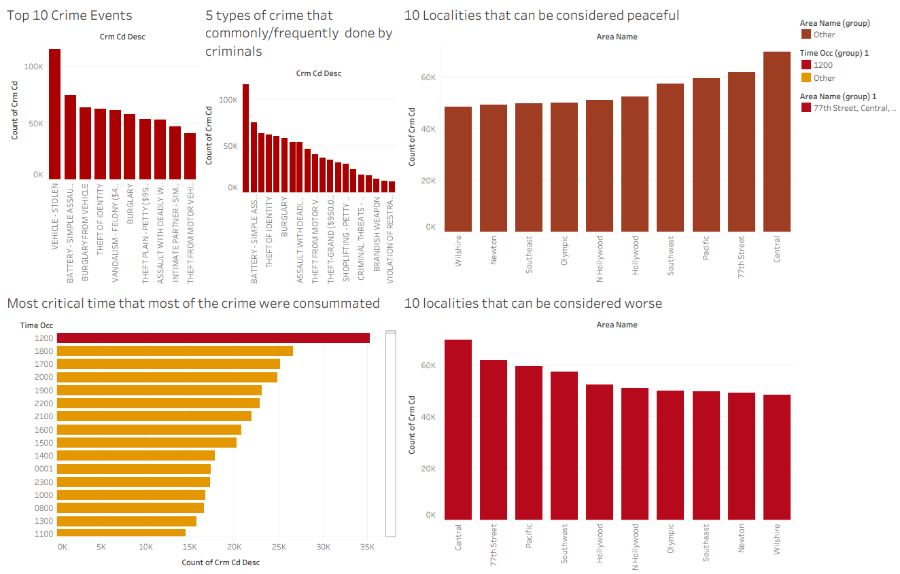

# Crime Data Analysis (Tableau)

A Tableau workbook analyzing crime patterns across localities, identifying safety trends, common offense types, and timing of incidents.

## 📊 Overview
This workbook explores crime data to highlight the safest and most at-risk localities, the most frequent crime types, and when crimes are most likely to occur.

## Key Worksheets
- **10 Localities that Can Be Considered Peaceful** – lowest-crime areas
- **10 Localities that Can Be Considered Worse** – highest-crime areas
- **5 Types of Crime Commonly Committed by Criminals** – most frequent offense types
- **Most Critical Time Crimes Were Consummated** – peak crime timing
- **Top 10 Crime Events** – most significant recorded incidents

## 🔗 Dataset
[View dataset on Google Sheets](https://docs.google.com/spreadsheets/d/1aSy---WAllnzBM1Xweo77zrvbi3aRfE7/edit?usp=sharing&ouid=110996342597967079299&rtpof=true&sd=true)

